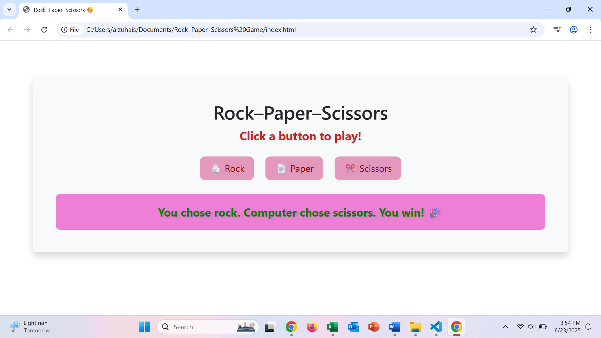

# Rock–Paper–Scissors Game 🎮

A fun and interactive web-based Rock–Paper–Scissors game built with **HTML**, **CSS**, and **jQuery**. Play against the computer and see who wins!

## 🛠️ Technologies Used
- HTML
- CSS
- jQuery (JavaScript)

## ✨ Features
- Choose Rock, Paper, or Scissors by clicking a button
- Computer makes a random choice
- Result is displayed dynamically
- Smooth fade-in animation using jQuery
- Color-coded results:
  - 🟦 Blue for Draw
  - 🟩 Green for Win
  - 🟥 Red for Loss

## 🎮 How to Play
1. Open the game in your browser.
2. Click on **Rock**, **Paper**, or **Scissors**.
3. The computer will randomly choose its move.
4. See the result instantly!

## 📷 Screenshot
